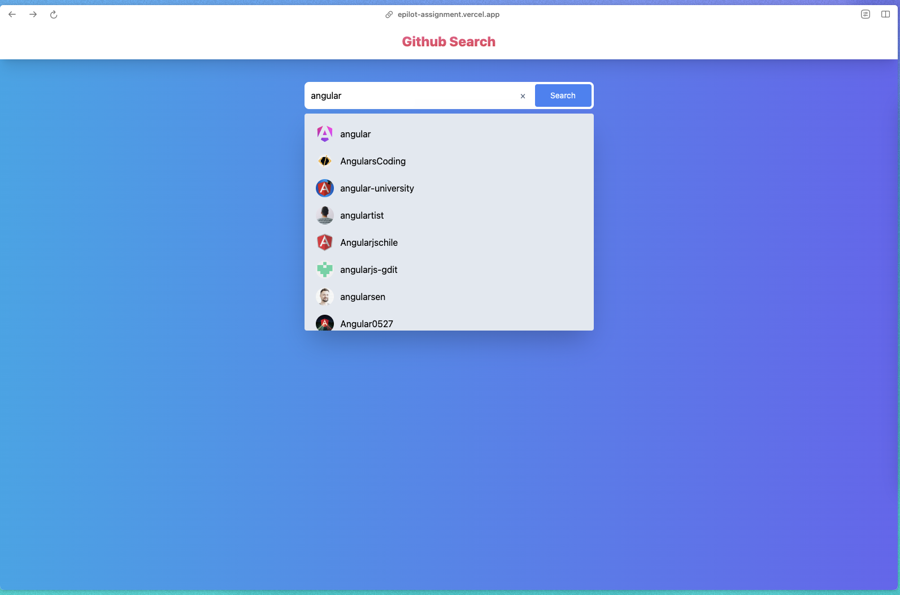
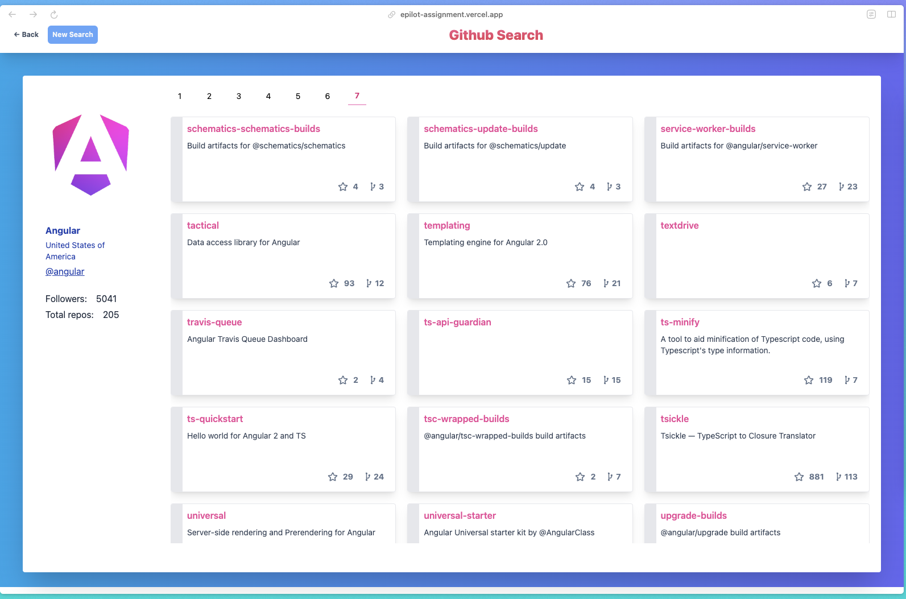

# Github Search

> Simple Github Search App

[Live Demo](https://epilot-assignment.vercel.app/)

## Application Setup

- The application is initialized with Vite, employing the React TypeScript template for a robust and efficient development environment.

### Configuring the Development Environment

- To set up your development environment, copy the `.env.local.example` file, rename it to `.env.local`, and update the `VITE_GH_TOKEN` with your GitHub API token. This is only needed when we get the rate limit errors from Github API.

## Application Features and Integration

- Designed as a Single Page Application (SPA), it offers a fluid user experience with client-side routing, facilitated by the latest version of React Router.
- React Router in this app includes data routing capabilities, utilizing `loader` and `actions` for effective data fetching and manipulation.
- The app integrates with the GitHub API for real-time data retrieval.
- TailwindCSS is used for all component styling.


<br />


## Technologies Used

- Vite + React + Typescript
- React Router@6
- TailwindCSS
- Playwright for e2e testing

## How to run locally

Install dependencies

```sh
npm install
```
**Development**

```sh
npm run dev
```
**Production build**

```sh
npm run build
npm run preview
```

## e2e Testing

Used playwright with UI mode for running the e2e tests.

```sh
npm run test:e2e
```
